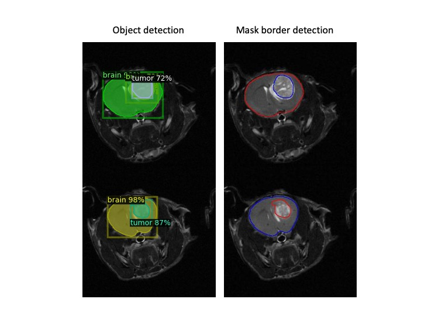

# Detectron2
Detectron2 based on the MASK R-CNN was developed by Facebook and seems to have good outcomes in a segmentation task for pre-clinical images of GBM brain model. After manually segmenting a small dataset comprising of 4 animals, the model was train on such images and consequently deployed on a validation and test data.

Seen the little amount of training data, the software made a very good job in detecting, segmenting and classifying tumor and healthy brain areas.

The Code was developed in GoogleColab with the use of a free GPU service.

This proof of concept code, demontrate that the detectron2 model has enough flexibility to be deployed on medical imaging with expected good results.
Here some of those.

.

